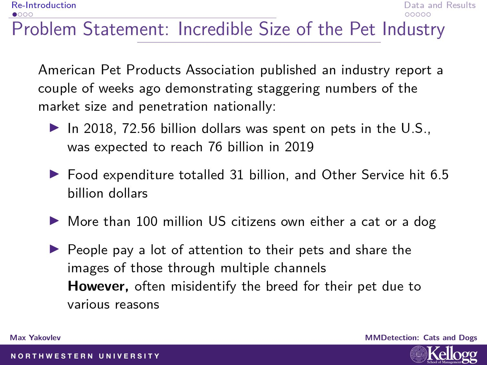
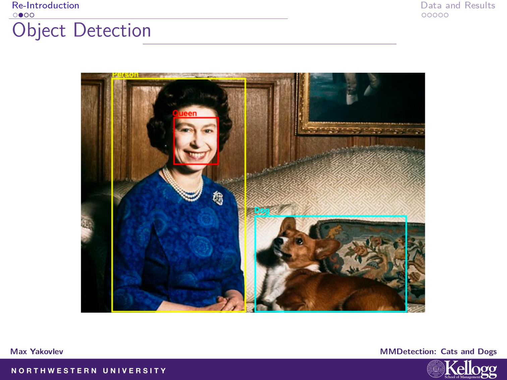
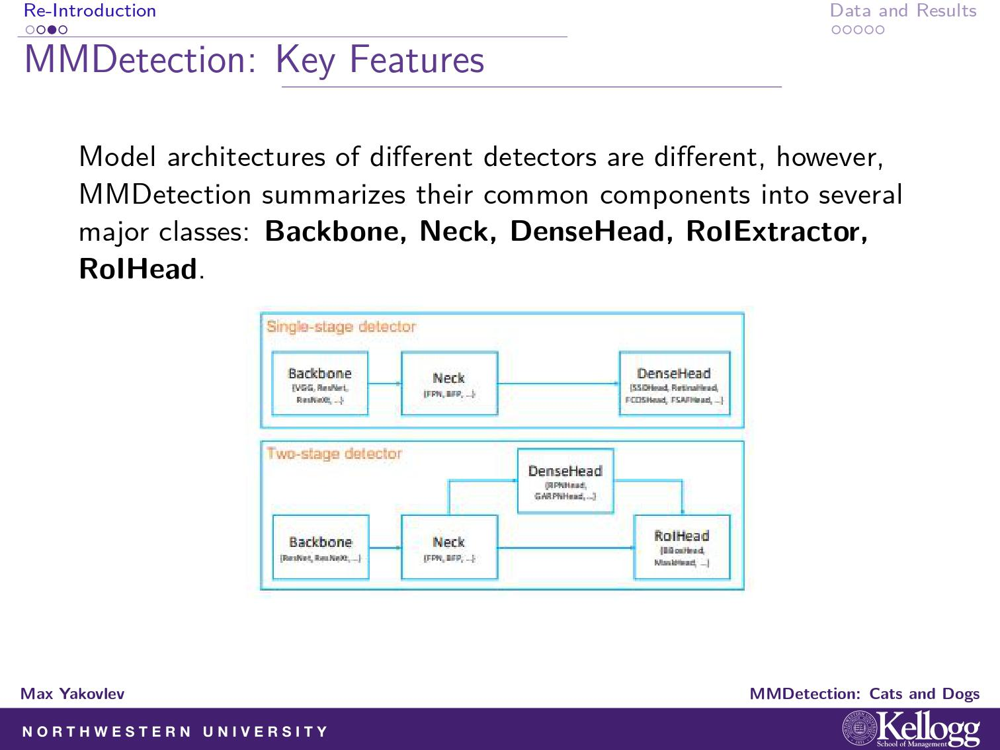
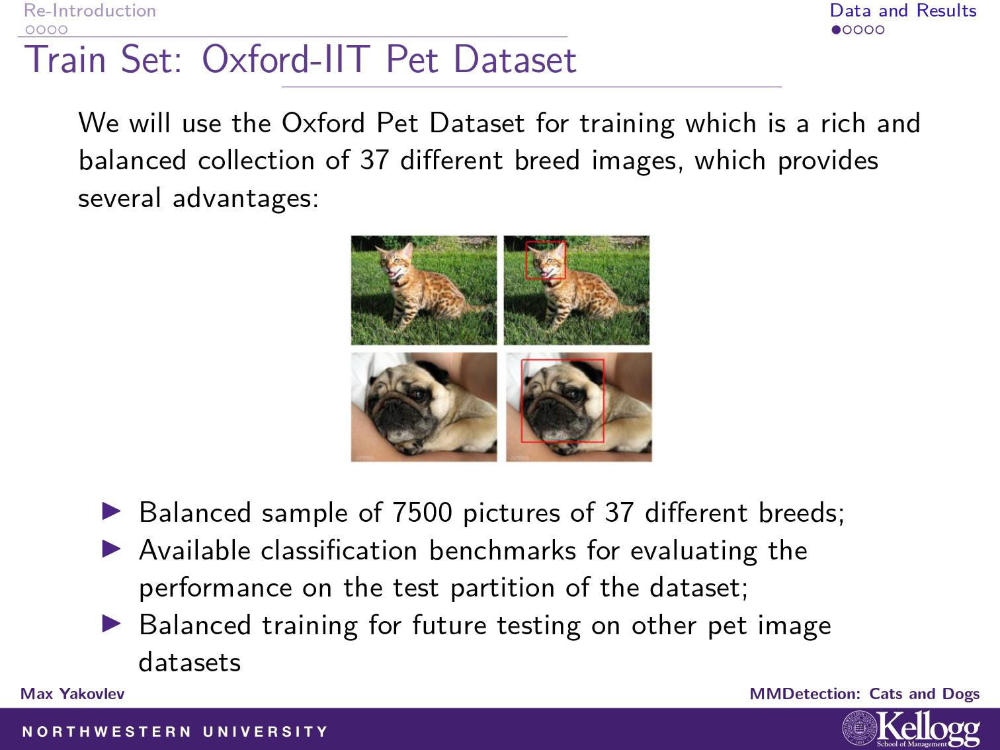
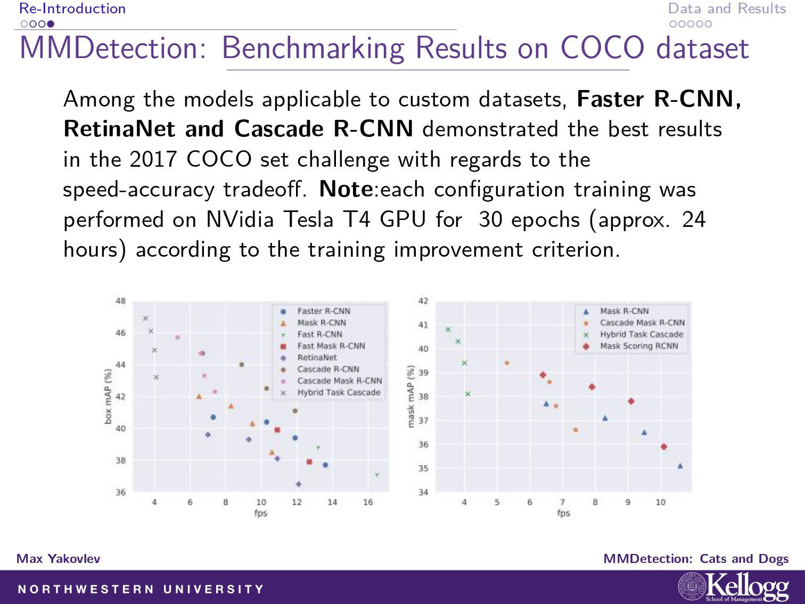
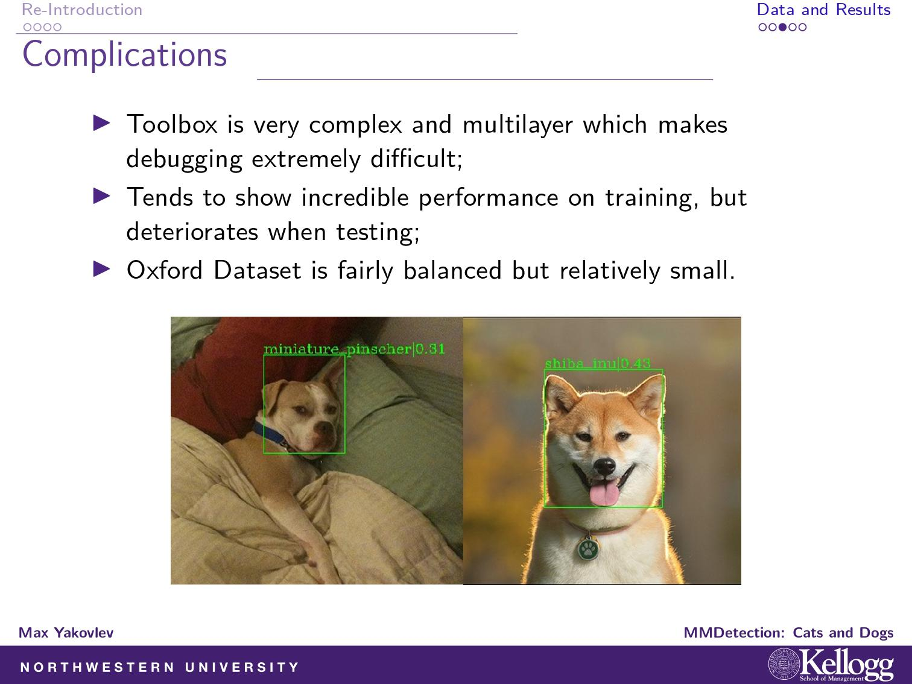
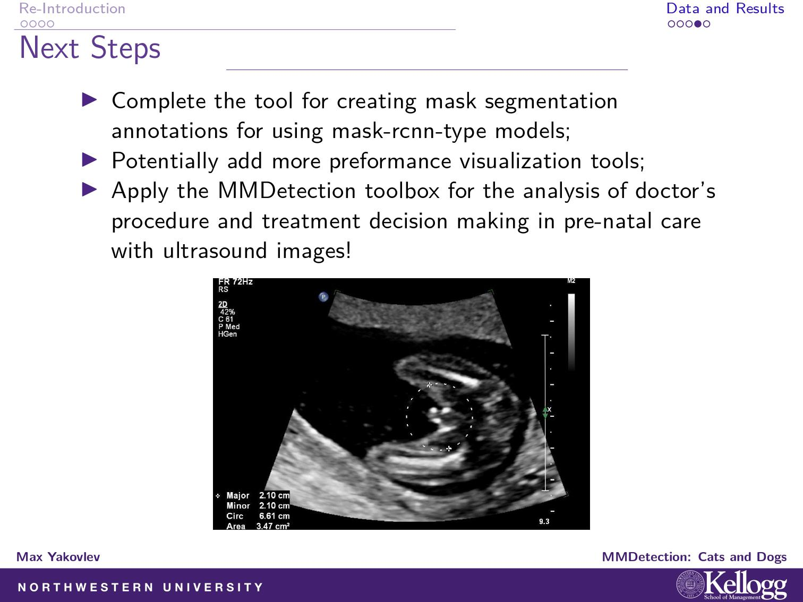

# MMDetection: Cats and Dogs Breed Object Detection

## Disclaimer
I'm not a CS student, and all of my background is in Econ and Operations Management. Please don't judge harshly if something is not at the level of complexity you expected, it's my first experience with Deep Learning.

## Problem Statement



**Solution**: breed identification using object detection



## MMDetection: Key Features


**Key Advantages:** 
 **Modular Design**

  We decompose the detection framework into different components and one can easily construct a customized object detection framework by combining different modules.

- **Support of multiple frameworks out of box**

  The toolbox directly supports popular and contemporary detection frameworks, *e.g.* Faster RCNN, Mask RCNN, RetinaNet, etc.

- **High efficiency**

  All basic bbox and mask operations run on GPUs now. The training speed is faster than or comparable to other codebases, including [Detectron](https://github.com/facebookresearch/Detectron), [maskrcnn-benchmark](https://github.com/facebookresearch/maskrcnn-benchmark) and [SimpleDet](https://github.com/TuSimple/simpledet).

 **State of the art**

  The toolbox stems from the codebase developed by the *MMDet* team, who won [COCO Detection Challenge](http://cocodataset.org/#detection-leaderboard) in 2018, and we keep pushing it forward.

## Dataset Used



**Note: good dataset with balanced classes.**

## Models Used 



## Installation and Usage

[] (link to github ipynb)

All the instructions can be found in the Google Colab Notebook.

## Performance (to be updated) 

## Complications



## Next Steps




## Citation

If you use this toolbox or benchmark in your research, please cite this project.

```
@article{mmdetection,
  title   = {{MMDetection}: Open MMLab Detection Toolbox and Benchmark},
  author  = {Chen, Kai and Wang, Jiaqi and Pang, Jiangmiao and Cao, Yuhang and
             Xiong, Yu and Li, Xiaoxiao and Sun, Shuyang and Feng, Wansen and
             Liu, Ziwei and Xu, Jiarui and Zhang, Zheng and Cheng, Dazhi and
             Zhu, Chenchen and Cheng, Tianheng and Zhao, Qijie and Li, Buyu and
             Lu, Xin and Zhu, Rui and Wu, Yue and Dai, Jifeng and Wang, Jingdong
             and Shi, Jianping and Ouyang, Wanli and Loy, Chen Change and Lin, Dahua},
  journal= {arXiv preprint arXiv:1906.07155},
  year={2019}
}
```


## Contact

Max Yakovlev - maksim.yakovlev@kellogg.northwestern.edu
